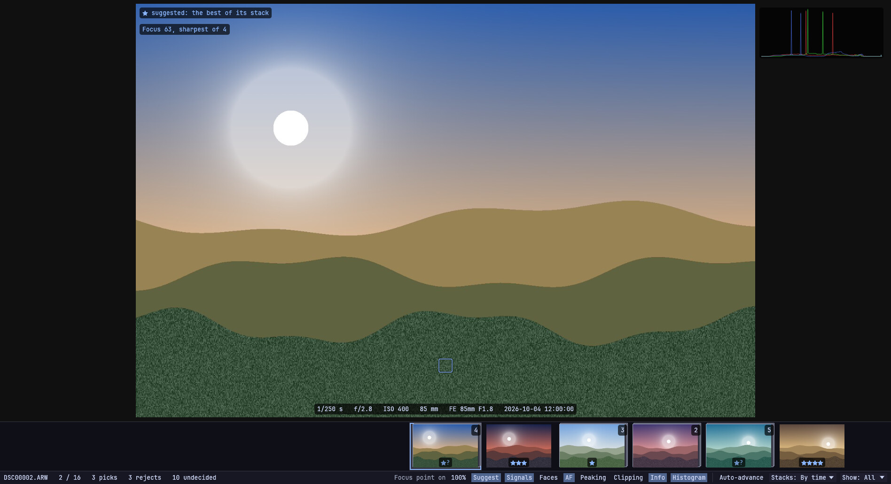
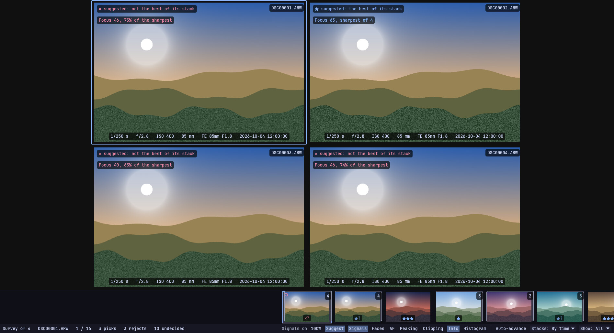
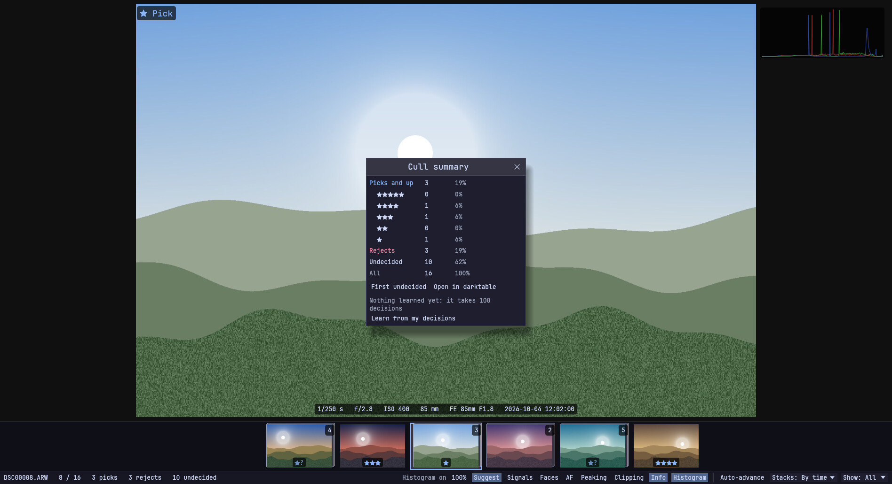

# Omacull

A fast, keyboard-first photo culler for [Omarchy](https://omarchy.org).
Open a folder of raws (or JPEGs, or PNGs), step through them without waiting, mark
picks, rejects and stars, and hand the folder to darktable.

> Omacull is an independent project. It is not made by or affiliated with
> Omarchy.

It's the first stage of one workflow: cull in Omacull, base edit in
darktable, retouch in [Omapix](https://github.com/michaelrubi/omapix),
export.



**Status:** pre-release (0.1.0, nothing tagged yet). Everything on the
[roadmap](docs/ROADMAP.md) is built and tested without a window, and its
reading of raws, faces and eyes has been checked against one real shoot
from a Sony ILCE-7M3. It hasn't yet been culled with for a whole shoot,
and it has only run on one machine: Omarchy (Arch, Hyprland). If you try
it, [say how it went](CONTRIBUTING.md).

## What it does

- **Never waits for a frame.** The camera's embedded preview is what you
  step through, with the next frames decoded ahead of you. Nothing is
  imported and there's no catalogue: the folder is the shoot.
- **Marks the way Bridge and Lightroom do:** P picks, X rejects, U
  unmarks, 1 to 5 are stars, Ctrl+Z undoes. Marks go straight into XMP
  sidecars darktable reads, leaving any edit already in them byte for byte
  as it was. Raws are never moved, changed or deleted.
- **Inspection:** Z for 100% (hold it for a look), on a real development
  of the raw. H histogram, J clipping, S focus peaking, F the camera's
  focus point, Shift+Z to zoom to it, I the shooting settings.
- **Faces:** E zooms to the eyes of the nearest face, and again to the
  next; Shift+E shows every face close up beside the frame.
- **Compare and survey:** C puts two frames side by side, N several, with
  zoom and pan locked together. / knocks a frame out until one is left.
- **Stacks:** Shift+G stacks bursts (by hand, by time, or by time and
  look), so a burst is one frame in the filmstrip. W picks the winner and
  rejects the rest.
- **Signals:** Q shows what was measured of a frame: how sharp it is at
  the eyes or the focus point and where that puts it in its burst, eyes
  that look shut, blown highlights.
- **Suggestions:** in a stack, the frame the signals favour is the one
  shown, and Y takes it. Once you've made a hundred or so decisions,
  Omacull learns from them, on your machine, and suggests marks it's sure
  of for you to take (Y) or leave. Nothing is ever marked on its own.
- **JPEGs and PNGs too:** a folder of them is culled the same way, with
  100% straight from the picture. Where raws sit with JPEGs or PNGs,
  Shift+F culls them all, or one format alone.
- **Getting around:** T a folder tree, M a summary of the cull, Shift+U
  the first undecided frame, Ctrl+E on to darktable.
- **The keepers on their own:** Ctrl+Shift+E copies what's shown (the
  picks, say, of a folder of 500) to another folder, each with its
  sidecar. Nothing is moved, and nothing already there is replaced.



Every shortcut can be changed in `~/.config/omacull/hotkeys.toml`, which
lists them all. [docs/DESIGN.md](docs/DESIGN.md) has the design and every
key; [docs/ROADMAP.md](docs/ROADMAP.md) what's built and what's still to
be tried.

## Install

Omacull needs Linux with Wayland (X11 is untested), a GPU with Vulkan,
and Little CMS 2. On Arch and Omarchy:

```bash
sudo pacman -S --needed lcms2 vulkan-icd-loader xdg-desktop-portal
```

Building needs a recent stable Rust (it's developed on 1.98).

### From source, for your user

```bash
git clone https://github.com/michaelrubi/omacull.git
cd omacull
make install
```

This puts the binary in `~/.local/bin` and adds a launcher entry and icon.
It doesn't change which app opens folders or raws by default. `make
uninstall` removes it all.

To run it without installing:

```bash
cargo run --release -- path/to/shoot
```

### As an Arch package

[packaging/arch/PKGBUILD](packaging/arch/PKGBUILD) builds `omacull-git`
from the newest commit. It isn't on the AUR yet.

```bash
cd packaging/arch
makepkg -si
```

The package installs the model downloader as `omacull-fetch-models`.

## Faces and eyes

These are optional: everything else works without them.

They run through the system's ONNX Runtime, on the CPU (`pacman -S
onnxruntime`). Omacull opens `/usr/lib/libonnxruntime.so`; set
`OMACULL_ORT_LIBRARY` if yours is elsewhere. Two small models do the
work: YuNet finds faces and eyes, and MediaPipe's face landmarker tells
whether the eyes are open. Omacull never goes online itself. A script
downloads the models (5 MB) and checks them:

```bash
scripts/fetch-models.sh
```

If Omapix is installed with its models, Omacull uses those and there's
nothing to fetch.

## What it learns, and where it keeps it

Every mark is appended to `~/.local/share/omacull/decisions.jsonl`, with
what was measured of the frame; so is every frame you looked at and left
unmarked, when you leave its folder. That log is what the suggestions are
learned from, and it never leaves your machine: no cloud, no account. The
model is a small one (`model.json` beside the log). It learns that soft,
shut-eyed and second-best frames go; taste in pictures is beyond it.
Delete the two files to start again. M shows what's been learned so far;
Shift+Q turns suggestions off.



## Other raw developers

Omacull writes what darktable reads: `DSC01234.ARW.xmp`, with a pick as
one star and a reject as a rating of -1. `~/.config/omacull/config.toml`
(written on first run, with every setting explained) changes that:

```toml
pick = 3                   # the stars a pick is written as
sidecar = "adobe"          # DSC01234.xmp, as Lightroom and Capture One name it
developer = "rawtherapee"  # the program Ctrl+E hands the folder to
```

For [LightCraft](https://github.com/storytold/lightcraft), `sidecar =
"adobe"` and `developer = "lightcraft"`: it reads the stars as stars and
a reject as its reject flag (checked against 0.4.0). Ctrl+E hands it only
the pictures shown, so with the picks showing, the rest never reach its
library.

## Other cameras

Sony ARW is what Omacull is built on and tested with. Nikon NEF, Canon
CR3 and Fuji RAF are read too, written from descriptions of the formats
and tried only on made-up files: none has been opened from a real camera
yet. If you have one, this says what Omacull finds in a folder of its
raws, and is worth sending in either way:

```bash
cargo run --release -p omacull-engine --example spike -- path/to/shoot
```

The focus point is only read from Sony's.

## Contributing

Bug reports, testing with other cameras and on other hardware, packaging
and code are all welcome. See [CONTRIBUTING.md](CONTRIBUTING.md).

## License

GPL-3.0-or-later. See [LICENSE](LICENSE). The models have their own
licences: YuNet is MIT, MediaPipe's face landmarker Apache-2.0.
